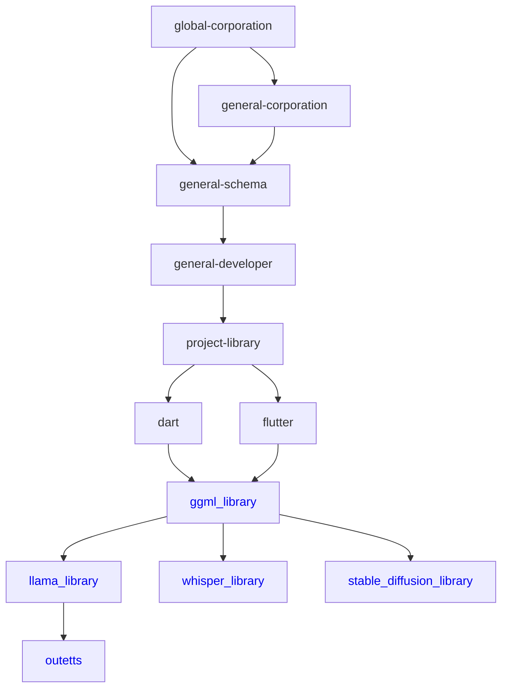

# General Developer

Actually in this world there are many crazy people, one of them is a developer, yes all developers are good but they don't understand a little about what a library is and why they make a library,

for us a library is a script that is specially designed to make it easier for people to develop a program, but many crazy developers don't know the basic meaning of the library
they make libraries and documents too, but not all of them can be understood / used easily.

Yes we know they are busy and have time to use for other things, and we also know we can be bad but we provide two options (Free & Paid), if you are in doubt before paying you can see our repository and see how to use it along with examples of projects that have used the library we made

Because of the reasons above we GENERAL DEVELOPER, founded this organization to show what a real library is.

short explanation.

maybe most people are confused about how to implement libraries in their projects, so understand yes

here there are many libraries all libraries published publicly are ready to use Especially modern arm 64 bit and x64 bit platforms (amd, intel, nvidia)

besides that if the library contains a native library (CPP / RUST / C etc.) it takes effort to compile the library yourself.

If there is the word wip in the description it means it is not ready to use and is still in the development stage,

library development so that it can be public cannot be done quickly this is considering the cost / busy developer and also the library coding style.

All libraries that we create are designed to run on all platforms and can add extension plugins as desired, and can be made fake demo (MOCK).

on average the libraries we create are based on the interests that we want / need, if anyone wants to please just request here / our social media.

if you want more features you can buy the library.

The meaning of buying here is that you don't pay 1x for one library, but rather a subscription.

But don't worry, we don't require you to pay so much xxx / there is a minimum, we don't mind even if you pay 1K Rupiah / even 1 dollar.

After subscribing to a sponsor on the General-Developer github

you get lots of libraries + documentation + complete tutorials.

In addition to getting the above, those of you who are able to pay a subscription can contribute to others / even the world,

The money you pay to buy the library will continue to be used for development,

Later we will continue to improve open source.

But don't worry, we won't opensource what you buy.
